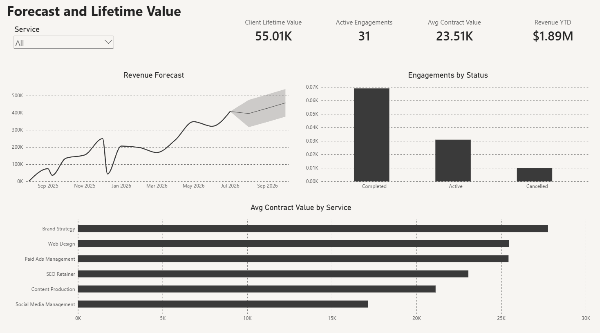

← [Back to Steadfast Business Analytics](https://github.com/SteadfastAnalytics/Business-Offerings)

# Service Business — Forecast and Lifetime Value Dashboard

## The Business

A service agency running multiple offerings — brand strategy, web design, paid ads, SEO, content, social media — needed to know which services and client relationships were actually worth the most, beyond just "revenue came in."

## What's On It

- **Relationship-level KPIs** — client lifetime value, active engagements, average contract value, and revenue year-to-date
- **Revenue forecast** — a forward-looking projection with a confidence band, not just a look backward
- **Engagements by status** — completed, active, and cancelled, so pipeline health is visible at a glance
- **Average contract value by service** — showing exactly which service lines are the most valuable per client, not just the most popular

## The Question It Answers

*Which services and client relationships are actually driving the business — and where is revenue headed next?*

Instead of treating every client and every service the same, the owner can see precisely which offerings command the highest contract value, and get a real forecast instead of a guess.

## Built With

Power BI, connected directly to the agency's invoicing and project-management data — refreshed automatically, no manual exports.

---

**Want something like this for your own business?** [See plans & pricing](https://github.com/SteadfastAnalytics/Business-Offerings#one-plan-add-exactly-what-you-need) · [Get in touch](https://github.com/SteadfastAnalytics/Business-Offerings#get-in-touch)
